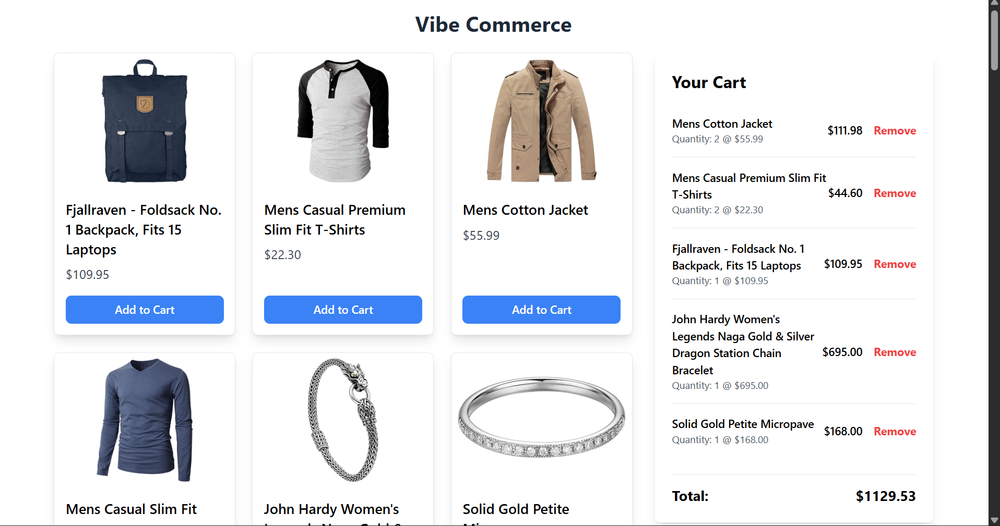
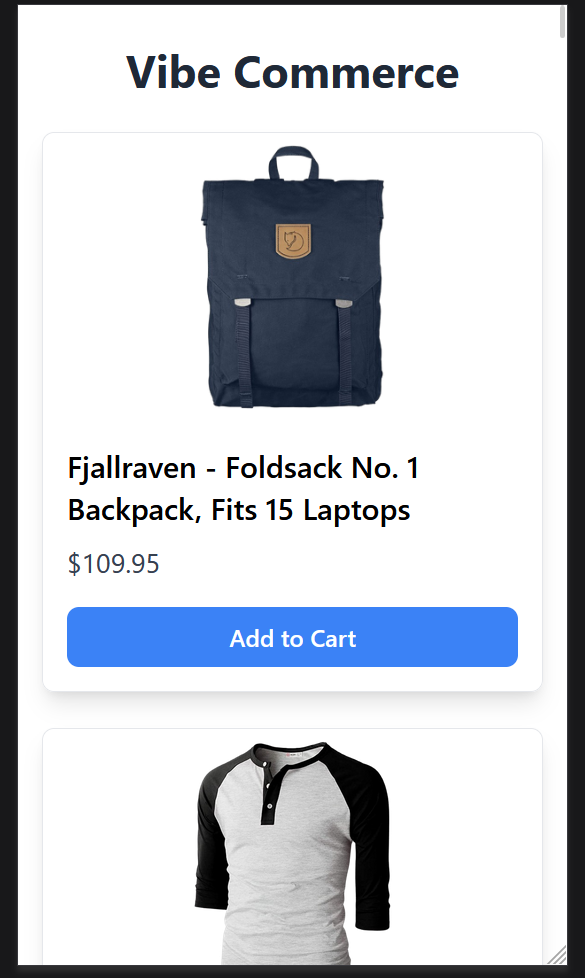
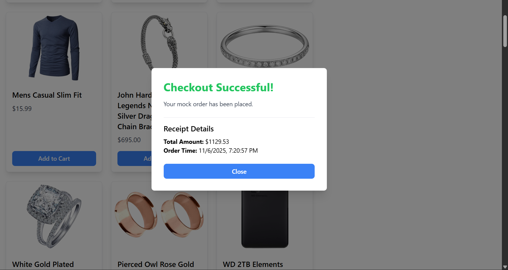
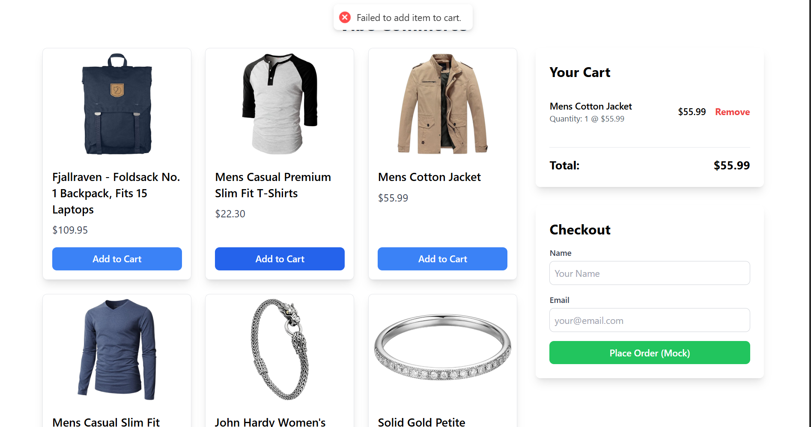

# Vibe Commerce - Full-Stack E-Commerce Cart

This project is a full-stack mock e-commerce shopping cart application built as a screening assignment for Vibe Commerce. It features a complete, responsive frontend built in React and a full REST API backend powered by Node.js, Express, and MongoDB.

### 🎥 Demo Video

[Link to your 1-2 minute Loom or YouTube demo video]

---

## ✨ Features

* **Product Grid:** Fetches products from a live API and displays them in a responsive grid.
* **Full Cart Functionality:** Add items, remove items, and see the cart update instantly.
* **Persistent State:** The shopping cart is stored in a MongoDB database, so it persists across sessions.
* **Live Total:** The cart total updates automatically as items are added or removed.
* **Mock Checkout:** A responsive checkout form that simulates an order and provides a receipt.
* **Responsive Design:** The UI is fully responsive and looks great on both mobile and desktop.

### 🎁 Bonus Features Implemented

* **Fake Store API Integration:** The backend database is automatically "seeded" with data from the [Fake Store API](https://fakestoreapi.com/) on first launch.
* **Global Error Handling:** A non-intrusive error banner alerts the user if API calls fail (e.g., "Failed to add item").
* **Professional UI/UX:** Used Tailwind CSS and Flexbox to create a clean, modern, and aligned layout.

---

## 📸 Screenshots

*(You should replace these links with your own screenshots)*

| Desktop View | Mobile View |
| :---: | :---: |
|  | |
| **Checkout Modal** | **Error Handling** |
|  |  |

---

## 🛠 Tech Stack

| Area | Technology |
| :--- | :--- |
| **Frontend** | React, Vite, Tailwind CSS, `axios` |
| **Backend** | Node.js, Express.js, `mongoose` |
| **Database** | MongoDB Atlas (Cloud Database) |
| **API Testing** | Postman (during development) |

---

## 📂 Project Structure

The project is organized into two main folders:

```

Vibe-Commerce-App/
├── backend/        # Node.js, Express, and MongoDB logic
│   ├── models/     # Mongoose schemas (Product, CartItem)
│   ├── routes/     # API route definitions (products.routes.js, cart.routes.js)
│   ├── .env        # (Must be created) Stores secret keys
│   └── server.js   # Main Express server entry point
│
├── frontend/       # React.js and Vite client application
│   ├── src/
│   │   ├── components/ # Reusable React components
│   │   ├── context/    # Global CartContext
│   │   ├── App.jsx     # Main app layout
│   │   └── main.jsx    # React entry point
│
└── README.md       # This file

````

---

## 🚀 Setup and Installation

To run this project locally, you will need to run both the **backend** and **frontend** servers simultaneously in two separate terminals.

### Prerequisites

* [Node.js](https://nodejs.org/) (v16 or later)
* `npm`
* A free [MongoDB Atlas](https://www.mongodb.com/cloud/atlas) account

---

### 1. Backend Setup

1. **Clone the repository:**
    ```bash
    git clone [https://github.com/uditttttt/Vibe-Commerce-App.git]
    cd Vibe-Commerce-App
    ```

2. **Navigate to the backend:**
    ```bash
    cd backend
    ```

3. **Install dependencies:**
    ```bash
    npm install
    ```

4. **Create your Environment File (`.env`):**
    Create a file named `.env` in the `/backend` folder and add the following, replacing `<YOUR_PASSWORD>` and the cluster URL with your own from MongoDB Atlas.

    ```
    PORT=5000
    MONGO_URI=mongodb+srv://dbUser:<YOUR_PASSWORD>@cluster0.xxxxx.mongodb.net/?retryWrites=true&w=majority
    ```
    > **Note:** Remember to update your MongoDB Atlas IP Whitelist to allow access (using `0.0.0.0/0` is easiest for development).

5. **Run the backend server:**
    ```bash
    npm run dev
    ```
    Your backend server should now be running on `http://localhost:5000` and connected to your database.

---

### 2. Frontend Setup

1. **Open a new terminal.**

2. **Navigate to the frontend:**
    (From the root `Vibe-Commerce-App` folder)
    ```bash
    cd frontend
    ```

3. **Install dependencies:**
    ```bash
    npm install
    ```

4. **Run the frontend server:**
    ```bash
    npm run dev
    ```
    Your React app will open automatically in your browser, usually on `http://localhost:5173`.

**You can now use the application!** The database will automatically seed with products when the app is first loaded.


